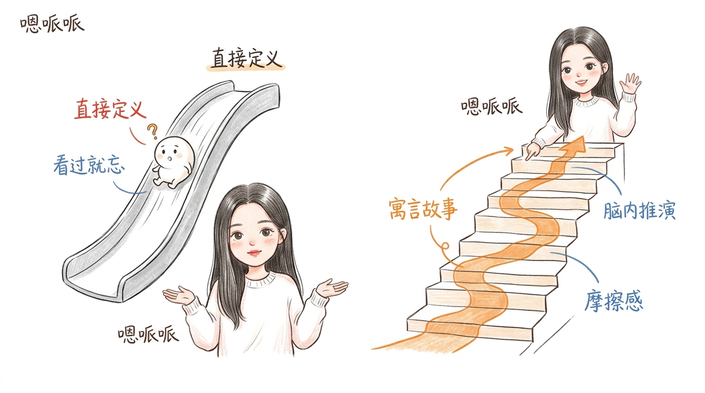
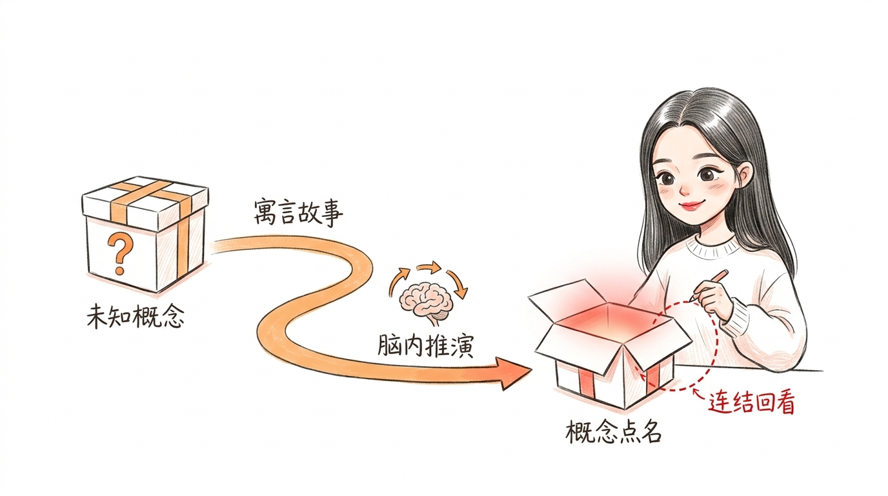

# 《2026-06-22 寓言式 Prompt 探索》文章配图方案

我们基于 [2026-06-22.md](file:///Users/habhy/Documents/NPIE-program/Antigravity%20CLI_Test/2026-06-22.md) 的核心观点与认知转折，设计了以下温暖手绘风的配图方案（以嗯哌哌 IP 为主视觉核心）。

所有的配图资产已自动保存至项目的 `assets/2026-06-22-illustrations/` 文件夹中。

---

## 📔 封面图 (Cover) 方案与 Prompt

为了呼应文章“寓言解释法”的主题，我们为文章设计了一个充满童话与探索感的封面插画方案。

* **核心隐喻**：一本巨大的打开的书，书页中延伸出一条通往发光“概念之钥”的橙色手绘小路，象征通过寓言故事探索未知概念。嗯哌哌站在书旁，微笑着伸手做出邀请的手势，邀请读者一同踏入故事的世界。
* **生图提示词 (Prompt)**：见下方折叠框。

<details>
<summary>点击展开 Cover-Illustration 封面生图提示词</summary>

```text
Generate one standalone 16:9 horizontal Chinese article cover illustration.

Visual DNA:
Pure white background. Warm hand-drawn style with soft pencil/ink lines and colored-pencil or light watercolor fill. Slightly organic, handmade pen strokes. Lots of empty white space. Sparse red/orange/blue handwritten Chinese annotations. Clean, warm, charming product-sketch feeling. No gradients, no shadows, no paper texture, no complex background, no commercial vector style, no PPT infographic look, no cold technical diagram, no realistic UI.

Recurring IP character required:
嗯哌哌, a warm and charming hand-drawn character with long straight dark center-parted hair flowing naturally past her shoulders, a soft rounded face with gentle features, large expressive dark eyes with a warm gentle gaze and subtle smile lines at the corners, soft arched eyebrows, small natural nose, rosy full lips, fair smooth skin with a natural faint blush. She wears a signature loose white knit sweater. Her proportions are slightly rounded and cute (eyes slightly larger, face soft), rendered in visible soft pencil/ink lines with colored-pencil or light watercolor warmth. 嗯哌哌 must be the core visual and emotional anchor of the scene — using her pose, expression, and gesture to convey the key idea, not passively standing in the corner.

Theme:
Storybook journey of concept exploration (封面：探索寓言故事与概念的奇幻旅程)

Structure type:
概念隐喻 (Conceptual Metaphor)

Core idea:
A fable story wraps a concept, inviting the reader to embark on a journey of discovery and sudden realization.

Composition:
In the center, draw a giant open book. From the pages of the open book, a winding orange path emerges and leads toward a glowing, sparkling key or star in the sky (representing the concept). The warm hand-drawn character 嗯哌哌 stands beside the open book, gesturing warmly with her hand toward the path, inviting the reader with a gentle and welcoming smile.

Suggested elements:
giant open book / winding orange path / glowing star key / 嗯哌哌

Chinese handwritten labels:
"寓言故事" / "概念之钥" / "奇幻旅程"

Color use:
Black/dark-gray for main line art and character outlines. Orange for main flow/path/arrows/guidance. Red only for key highlights/emphasis/results. Blue only for secondary notes or feedback/system state. Warm soft pink/peach tones for 嗯哌哌's skin and sweater warmth — use sparingly.

Constraints:
One image explains only one core structure. Keep the main subject around 40%-60% of the canvas. Preserve at least 35% blank white space. Use at most 5-8 short handwritten Chinese labels. Do not write a title in the top-left corner. Do not write the structure type on the image. Do not make it a formal diagram, course slide, or dense explainer. Do not copy prior examples unless explicitly requested; invent a fresh visual metaphor for this specific article. It should feel warm and charming but still clean and clear — not cold, not overly cute, not childish.
```

</details> Easter Egg: Cover Prompt added successfully.

---

## 🖼️ 已生成配图及排版建议

### 1. 「直接定义」与「寓言故事」的对比 (光滑 vs 摩擦)
* **文章位置**：放置在第 30-31 行后（在“*可真正能刻进大脑的，往往偏偏是那些带着点“摩擦感”的东西。*”之后）。
* **核心意图**：对比 AI 直接给出定义的「光滑无阻（容易忘）」与寓言故事提供的「摩擦与脑内推演（印象深）」。
* **画风设计**：左侧是光滑的滑梯，代表直接定义；右侧是带有因果阶梯和攀登路线的手绘楼梯，嗯哌哌在楼梯顶端恍然大悟。



* **文件路径**：[01-definition-vs-story.jpg](01-definition-vs-story.jpg)

---

### 2. 寓言式解释的结构流程 (Fable Explainer Flow)
* **文章位置**：放置在第 20-21 行后（在第一节模板及中文释义后：“*串起它们和这个概念之间的关系。*”之后）。
* **核心意图**：展示 Amanda Askell 的寓言 Prompt 工作流核心步骤：未知概念 -> 故事旅程（脑内推演） -> 概念点名揭晓 -> 连结回看故事细节。
* **画风设计**：从神秘箱子（未知概念）出发，经由手绘橙色小径（寓言故事/脑内推演），最终到达打开并散发红光的宝箱（概念点名），嗯哌哌在一旁用红色虚线将它们串联回看。



* **文件路径**：[02-fable-explainer-flow.jpg](02-fable-explainer-flow.jpg)

---

## 🎨 后续设计与生图 Prompts（因额度限制暂未生成，可后续补充）

由于生图 API 今日额度耗尽，以下 3 张配图已为您完成了全套的画面构想与 **中英生图 Prompts**。您可以随时在额度恢复后，或者复制到其他生图工具中进行生成。生成后请保存至 `assets/2026-06-22-illustrations/` 文件夹下。

---

### 3. 体裁与视角的改变 (改变体裁折射不同切面)
* **建议位置**：放置在第 66-67 行后（在“*而这两者又都和直接给出定义大不相同，而这种差别本身就很有教学意义。*”之后）。
* **核心意图**：不同的故事体裁（如侦探故事、神话、未来备忘录）就像不同的手持滤镜，折射出同一概念的不同切面与边缘情形。
* **画面构想**：
  * **结构类型**：概念隐喻
  * **画面描述**：画面中央是一个精美的多面棱镜（代表“核心概念”），嗯哌哌坐在右侧，手里拿着几块手写有“侦探故事”、“神话”和“未来备忘录”字样的彩色透明滤镜片，调皮地举起其中一片看向棱镜，棱镜的光芒折射出不同的色彩与侧面。
  * **建议标注**："核心概念" / "侦探故事" / "折射不同切面" / "多维理解"。

<details>
<summary>点击展开 03-genre-perspectives 提示词</summary>

```text
Generate one standalone 16:9 horizontal Chinese article illustration.

Visual DNA:
Pure white background. Warm hand-drawn style with soft pencil/ink lines and colored-pencil or light watercolor fill. Slightly organic, handmade pen strokes. Lots of empty white space. Sparse red/orange/blue handwritten Chinese annotations. Clean, warm, charming product-sketch feeling. No gradients, no shadows, no paper texture, no complex background, no commercial vector style, no PPT infographic look, no cold technical diagram, no realistic UI.

Recurring IP character required:
嗯哌哌, a warm and charming hand-drawn character with long straight dark center-parted hair flowing naturally past her shoulders, a soft rounded face with gentle features, large expressive dark eyes with a warm gentle gaze and subtle smile lines at the corners, soft arched eyebrows, small natural nose, rosy full lips, fair smooth skin with a natural faint blush. She wears a signature loose white knit sweater. Her proportions are slightly rounded and cute (eyes slightly larger, face soft), rendered in visible soft pencil/ink lines with colored-pencil or light watercolor warmth. 嗯哌哌 must be the core visual and emotional anchor of the scene — using her pose, expression, and gesture to convey the key idea, not passively standing in the corner.

Theme:
Different genres of storytelling refract different facets of the same concept (改变体裁以折射概念的不同切面)

Structure type:
概念隐喻 (Conceptual Metaphor)

Core idea:
Story genres like "detective stories", "myths", or "corporate memos" act like filters, refracting the same core concept to highlight its different facets and edge cases.

Composition:
In the center, draw a glowing hand-drawn prism crystal labeled with handwritten Chinese "核心概念". On the right, 嗯哌哌 sits and holds up a small hand-held filter labeled with "侦探故事", looking through it playfully. Wavelengths of light refract from the crystal through different filters, illuminating different facets of the crystal.

Suggested elements:
prism crystal / hand-held filters / light refraction / 嗯哌哌

Chinese handwritten labels:
"核心概念" / "侦探故事" / "科幻备忘录" / "折射不同切面" / "多维理解"

Color use:
Black/dark-gray for main line art and character outlines. Orange for main flow/path/arrows/guidance. Red only for key highlights/emphasis/results. Blue only for secondary notes or feedback/system state. Warm soft pink/peach tones for 嗯哌哌's skin and sweater warmth — use sparingly.

Constraints:
One image explains only one core structure. Keep the main subject around 40%-60% of the canvas. Preserve at least 35% blank white space. Use at most 5-8 short handwritten Chinese labels. Do not write a title in the top-left corner. Do not write the structure type on the image. Do not make it a formal diagram, course slide, or dense explainer. Do not copy prior examples unless explicitly requested; invent a fresh visual metaphor for this specific article. It should feel warm and charming but still clean and clear — not cold, not overly cute, not childish.
```
</details>

---

### 4. 篇幅长短的策略 (篇幅控制：严苛测试 vs 丰富细节)
* **建议位置**：放置在第 58-59 行后（在“*更短的寓言则会逼着模型抓住概念真正的核心。*”之后）。
* **核心意图**：展示长故事与短故事对测试概念的不同作用。短故事就像一个窄木桥，测试概念最本质的骨架；长故事则是一条宽阔的桥梁，能承载丰富的细节。
* **画面构想**：
  * **结构类型**：前后对比
  * **画面描述**：左侧代表“短故事”，是一根很窄的单木桥，嗯哌哌在上面保持平衡专注行走（代表直击骨架）；右侧代表“长故事”，是一座宽敞的多车道木桥，嗯哌哌在上面舒适悠闲散步，桥面上点缀着书籍和咖啡杯（代表丰富细节）。
  * **建议标注**："短故事" / "核心骨架" / "长故事" / "丰富细节"。

<details>
<summary>点击展开 04-length-strategies 提示词</summary>

```text
Generate one standalone 16:9 horizontal Chinese article illustration.

Visual DNA:
Pure white background. Warm hand-drawn style with soft pencil/ink lines and colored-pencil or light watercolor fill. Slightly organic, handmade pen strokes. Lots of empty white space. Sparse red/orange/blue handwritten Chinese annotations. Clean, warm, charming product-sketch feeling. No gradients, no shadows, no paper texture, no complex background, no commercial vector style, no PPT infographic look, no cold technical diagram, no realistic UI.

Recurring IP character required:
嗯哌哌, a warm and charming hand-drawn character with long straight dark center-parted hair flowing naturally past her shoulders, a soft rounded face with gentle features, large expressive dark eyes with a warm gentle gaze and subtle smile lines at the corners, soft arched eyebrows, small natural nose, rosy full lips, fair smooth skin with a natural faint blush. She wears a signature loose white knit sweater. Her proportions are slightly rounded and cute (eyes slightly larger, face soft), rendered in visible soft pencil/ink lines with colored-pencil or light watercolor warmth. 嗯哌哌 must be the core visual and emotional anchor of the scene — using her pose, expression, and gesture to convey the key idea, not passively standing in the corner.

Theme:
Contrast of length in fable writing (篇幅控制：严苛测试 vs 丰富细节)

Structure type:
前后对比 (Left/Right Contrast)

Core idea:
Short fables compress the concept to test its core framework, while long fables carry rich details and multiple layers.

Composition:
On the left of the white background, draw a narrow single-log bridge with a character balancing carefully on it, representing "短故事" (Short Fable) which tests the core bones. On the right, draw a wide, sturdy multi-lane wooden bridge where 嗯哌哌 walks relaxedly, surrounded by books and a small coffee cup, representing "长故事" (Long Fable) carrying rich details.

Suggested elements:
log bridge / wide wooden bridge / books / 嗯哌哌

Chinese handwritten labels:
"短故事" / "核心骨架" / "长故事" / "丰富细节"

Color use:
Black/dark-gray for main line art and character outlines. Orange for main flow/path/arrows/guidance. Red only for key highlights/emphasis/results. Blue only for secondary notes or feedback/system state. Warm soft pink/peach tones for 嗯哌哌's skin and sweater warmth — use sparingly.

Constraints:
One image explains only one core structure. Keep the main subject around 40%-60% of the canvas. Preserve at least 35% blank white space. Use at most 5-8 short handwritten Chinese labels. Do not write a title in the top-left corner. Do not write the structure type on the image. Do not make it a formal diagram, course slide, or dense explainer. Do not copy prior examples unless explicitly requested; invent a fresh visual metaphor for this specific article. It should feel warm and charming but still clean and clear — not cold, not overly cute, not childish.
```
</details>

---

### 5. 追问与边缘情形的探索 (What failed to capture?)
* **建议位置**：放置在第 76-77 行后（文章最末尾，以思考收尾）。
* **核心意图**：通过追问“这个故事没有捕捉到概念的哪个方面？”，从而让 AI 指出被简化的边缘情形，达到深度理解。
* **画面构想**：
  * **结构类型**：概念隐喻
  * **画面描述**：一幅手绘拼图板（代表“故事解释”），拼图接近完整，但在边缘漏出了一个空缺口。嗯哌哌正拿着放大镜，仔细端详那个空出来的拼图槽，脸上写满思索和好奇。旁边放着一块写有“未涵盖边缘”的拼图片（代表边缘情形）。
  * **建议标注**："故事解释" / "未涵盖边缘" / "追问缺陷" / "深度理解"。

<details>
<summary>点击展开 05-missing-piece 提示词</summary>

```text
Generate one standalone 16:9 horizontal Chinese article illustration.

Visual DNA:
Pure white background. Warm hand-drawn style with soft pencil/ink lines and colored-pencil or light watercolor fill. Slightly organic, handmade pen strokes. Lots of empty white space. Sparse red/orange/blue handwritten Chinese annotations. Clean, warm, charming product-sketch feeling. No gradients, no shadows, no paper texture, no complex background, no commercial vector style, no PPT infographic look, no cold technical diagram, no realistic UI.

Recurring IP character required:
嗯哌哌, a warm and charming hand-drawn character with long straight dark center-parted hair flowing naturally past her shoulders, a soft rounded face with gentle features, large expressive dark eyes with a warm gentle gaze and subtle smile lines at the corners, soft arched eyebrows, small natural nose, rosy full lips, fair smooth skin with a natural faint blush. She wears a signature loose white knit sweater. Her proportions are slightly rounded and cute (eyes slightly larger, face soft), rendered in visible soft pencil/ink lines with colored-pencil or light watercolor warmth. 嗯哌哌 must be the core visual and emotional anchor of the scene — using her pose, expression, and gesture to convey the key idea, not passively standing in the corner.

Theme:
Exploring edge cases through follow-up questions (追问被简化与未涵盖的边缘情形)

Structure type:
概念隐喻 (Conceptual Metaphor)

Core idea:
By asking "what aspect of the concept did the story fail to capture", we discover the simplified parts and edge cases of the concept, completing our understanding.

Composition:
A hand-drawn jigsaw puzzle board showing a complete shape, but with one critical edge piece missing. 嗯哌哌 is leaning over the puzzle board, looking closely at the missing slot with a magnifying glass in her hand, looking thoughtful. A single puzzle piece with a red outline sits next to the board, representing the edge case.

Suggested elements:
jigsaw puzzle / missing piece / magnifying glass / 嗯哌哌

Chinese handwritten labels:
"故事解释" / "未涵盖边缘" / "追问缺陷" / "深度理解"

Color use:
Black/dark-gray for main line art and character outlines. Orange for main flow/path/arrows/guidance. Red only for key highlights/emphasis/results. Blue only for secondary notes or feedback/system state. Warm soft pink/peach tones for 嗯哌哌's skin and sweater warmth — use sparingly.

Constraints:
One image explains only one core structure. Keep the main subject around 40%-60% of the canvas. Preserve at least 35% blank white space. Use at most 5-8 short handwritten Chinese labels. Do not write a title in the top-left corner. Do not write the structure type on the image. Do not make it a formal diagram, course slide, or dense explainer. Do not copy prior examples unless explicitly requested; invent a fresh visual metaphor for this specific article. It should feel warm and charming but still clean and clear — not cold, not overly cute, not childish.
```
</details>

