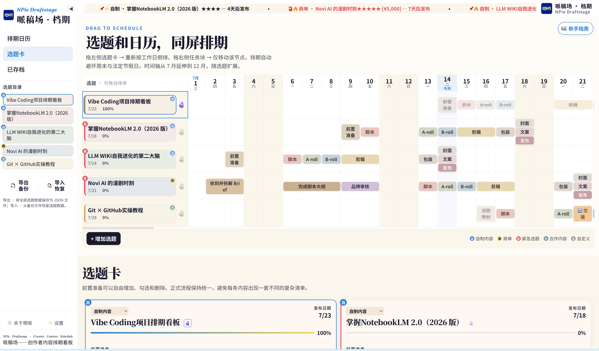
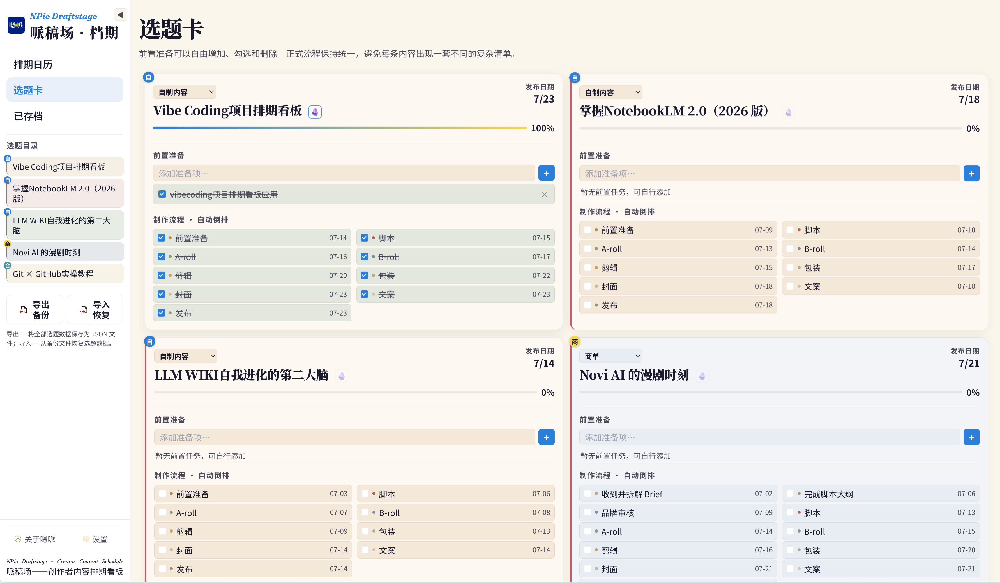

# 哌稿场 · 档期 — NPie Draftstage

> 面向自媒体创作者的内容排期与流程管理工具。
> 纯前端、零依赖，浏览器打开即可使用。

## 项目简介

哌稿场 · 档期 是一款帮助自媒体和内容团队管理选题排期的前端工具。它将“选题 + 发布计划 + 制作节点”可视化为日历排期，并自动按照工作日倒排制作流程。

本项目适合以下场景：

- 多条内容同时推进
- 商单与自制内容混合管理
- 需要自动避开周末与法定假日
- 希望把风险与紧急程度前置到日程中




## 主要特点

- ✅ **纯前端、零依赖**：无需安装，直接打开 `content-os.html` 即用
- ✅ **日历排期可视化**：横向时间轴 + 纵向选题，一眼看清进度
- ✅ **工作日倒排**：自动跳过周末和 2026 年中国法定节假日
- ✅ **双轨工作流**：自制内容与商单流程分别管理
- ✅ **可自定义工作流节点**：流程配置自由修改，倒排算法自动适配
- ✅ **跑马灯优先提醒**：紧急度、发布日期、商单金额等指标组合展示
- ✅ **Obsidian 链接支持**：选题可绑定 `obsidian://` 笔记链接
- ✅ **主题与暗色模式**：支持 6 套主题 + 暗色模式
- ✅ **数据持久化**：本地存储 + JSON 导入导出备份

## 功能概览

### 排期日历

- 横向时间轴自动扩展
- 选题按行展示，任务节点按日期排布
- 同日多任务自动错开，避免遮挡
- 拖拽即可调整选题排期或单个任务节点

### 选题卡

- 前置准备清单自由增删
- 自动倒排制作流程节点日期
- 进度条实时联动
- 自制内容与商单不同颜色区分

### 工作流类型

| 类型 | 流程节点 |
|------|----------|
| 自制内容 | 前置准备 → 脚本 → A-roll → B-roll → 剪辑（2天）→ 包装 → 封面/文案/发布 |
| 商单 | 收到 Brief（2天）→ 脚本大纲（3天）→ 品牌审核（2天）→ 脚本 → A-roll → B-roll → 剪辑（2天）→ 包装 → 封面/文案/发布 |

### 选题状态

- 进行中：1%–99%
- 已完成：100% → 可右键存档
- 已放弃：0% → 可右键放弃

### 其他亮点

- 侧边栏支持折叠，收起后仍可操作导入/导出
- 顶部跑马灯自动滚动紧急/临近/已完成内容
- 任务块双击可重命名
- 右键菜单支持上下文操作

## 快速开始

1. 下载仓库
2. 用浏览器打开 `content-os.html`
3. 添加选题并开始排期

> 支持 Chrome / Safari / Edge / Firefox。首次打开会加载外部字体与样式资源。

## 使用说明

| 操作 | 说明 |
|------|------|
| 新建选题 | 点击「+ 增加选题」，填写名称、类型、发布日期等 |
| 调整排期 | 拖拽选题行到目标日期 |
| 微调节点 | 拖拽单个任务块调整日期 |
| 右键空格子 | 新增日程 |
| 右键任务格 | 删除节点 |
| 存档 | 进度 100% 时右键存档 |
| 放弃 | 进度 0% 时右键放弃 |
| 导入/导出 | 侧边栏 JSON 备份/恢复 |

## 项目结构

```text
NPie_Draftstage/
├── content-os.html          # HTML 页面
├── CSS/
│   ├── content-os.css       # 样式文件
│   └── theme-editorial.css  # 蓝黄主题样式
├── JS/
│   └── content-os.js        # 业务逻辑脚本
├── IMG/                     # 图片资源
├── CLAUDE.md                # 开发规范
├── prompt.md                # 功能说明与复现提示
└── README.md                # 本文件
```

## 技术栈

- HTML / CSS / JavaScript
- 纯前端实现，零构建工具
- 数据持久化：localStorage + JSON 导入导出
- CSS 变量驱动主题系统

## 许可证

MIT
